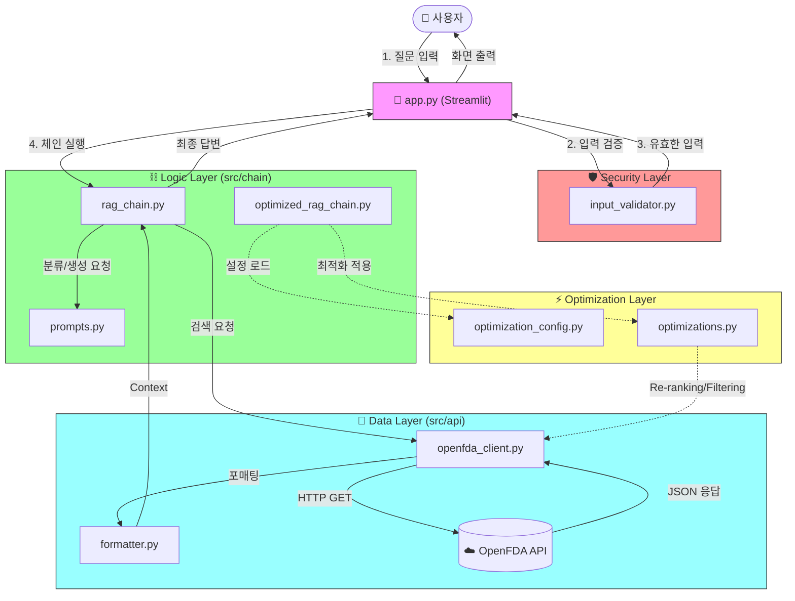

<div align="center">

# 💊 OpenFDA 의약품 정보 Q&A

[](https://python.org)
[](https://streamlit.io)
[](https://openai.com)
[](https://langchain.com)
[](https://open.fda.gov)

<br/>

**미국 FDA 공공데이터(OpenFDA) 기반 실시간 의약품 정보 챗봇**

</div>

---

> [!CAUTION]
> **⚠️ 의료 면책 조항 (Medical Disclaimer)**
> 
> 본 시스템은 **OpenFDA 데이터**를 기반으로 정보를 제공하며, **의학적 진단이나 처방을 대신할 수 없습니다.**
> 
> - 🔴 제공된 정보는 실시간 API 호출 결과이나, AI 가공 과정에서 부정확한 내용이 포함될 수 있습니다.
> - 🔴 **모든 건강 관련 결정은 반드시 의사 또는 약사와 상담 후 진행하세요.**
> - 🔴 본 시스템 사용으로 인한 어떠한 피해에 대해서도 책임지지 않습니다.

---

## 📋 목차

- [기술 스택](#-기술-스택)
- [프로젝트 구조](#-프로젝트-구조)
- [시스템 아키텍처](#-시스템-아키텍처)
- [단계별 상세 설명](#단계별-상세-설명)
- [실행 방법](#-실행-방법)
- [질문 예시](#-질문-예시)
- [주요 설정](#-주요-설정)
- [팀원 소개](#-팀원-소개)

---

## 🛠 기술 스택

| 분류 | 기술 | 설명 |
|:---:|:---:|:---|
| 🖥️ **UI** | Streamlit | Chat Interface 제공 |
| 🤖 **Classifier** | GPT-5-nano | 질문 의도 분류 (Router) |
| ✍️ **Generator** | GPT-4.1-mini | 최종 답변 생성 |
| ☁️ **Data Source** | OpenFDA API | 실시간 의약품 라벨 정보 (Labeling) |
| 🔗 **Orchestration** | LangChain | RAG 파이프라인 구성 |

---

## 📁 프로젝트 구조

```
.
├── 🚀 app.py                    # Streamlit 메인 앱
├── 📋 requirements.txt          # 패키지 의존성
├── 📂 src/
    ├── ⚙️ config.py             # 환경 설정 (API Key 등)
    ├── 📡 api/
    │   ├── openfda_client.py    # OpenFDA API 호출 클라이언트
    │   └── formatter.py         # JSON 응답 데이터 포매팅
    ├── ⛓️ chain/
    │   ├── rag_chain.py         # RAG 파이프라인 (분류 -> 검색 -> 생성)
    │   ├── optimized_rag_chain.py # 최적화된 RAG 파이프라인
    │   └── prompts.py           # LLM 프롬프트 템플릿
    ├── 🛡️ security/
    │   ├── input_validator.py   # 입력값 검증
    │   └── response_validator.py # 응답 검증
    └── 🛠️ utils/
        └── langsmith_config.py  # LangSmith 설정
└── 📊 evaluation/           # 평가 관련 파일
```

---

## 🔄 시스템 아키텍처

본 프로젝트는 **Router 패턴**을 기반으로 한 RAG 시스템이며, 보안 및 최적화 모듈이 통합되어 있습니다.



### 🧩 주요 모듈 상세 설명

- **애플리케이션 계층 (`app.py`)**: 사용자 인터페이스 메인 진입점입니다. `src.security`를 통해 입력을 검증하고, `rag_chain`을 통해 답변을 생성합니다.

- **보안 계층 (`src/security`)**: `input_validator.py`를 통한 Prompt Injection 및 과도한 길이, 특수문자 등을 필터링합니다.

- **로직 및 최적화 계층 (`src`)**:
  - `chain/rag_chain.py`: Router 패턴 기반 RAG 파이프라인.
  - `chain/optimized_rag_chain.py`: 검색 최적화 및 Re-ranking 적용.
  - `optimization_config.py`: 실험을 위한 다양한 파라미터 정의.
  - `optimizations.py`: 실제 최적화 로직 수행.

- **데이터 계층 (`src/api`)**: OpenFDA REST API와 통신 클라이언트 및 응답 데이터 포매터.

---

## 단계별 상세 설명

### Phase 1: Classifier (Router)
- **파일**: [prompts.py](/src/chain/prompts.py) (`CLASSIFIER_PROMPT`)
- **역할**: 
    - LLM(GPT-5-nano)이 사용자의 질문을 분석하여 `category`와 `keyword`를 추출합니다.
    - 한국어 증상 키워드를 영어 의학 용어로 번역하여 Search Engine(OpenFDA)의 정확도를 높입니다.
    - Few-shot 예시를 통해 모호한 입력에 대한 대응 능력을 확보합니다.

### Phase 2: Dispatcher (Logic)
- **파일**: [rag_chain.py](/src/chain/rag_chain.py) (`search_openfda`)
- **역할**: 
    - 분류 결과에 따라 실제 API 호출 함수를 매칭합니다.
    - `invalid` 카테고리일 경우 검색을 생략하고 즉시 응답 생성 단계로 넘깁니다.

### Phase 3: Data Retrieval (Search Engine)
- **파일**: [openfda_client.py](/src/api/openfda_client.py)
- **역할**: 
    - 라우팅된 경로에 따라 OpenFDA API의 특정 필드(`openfda.brand_name`, `openfda.generic_name`, `indications_and_usage`)를 쿼리합니다.

### Phase 4: Generator (Synthesis)
- **파일**: [prompts.py](/src/chain/prompts.py) (`ANSWER_PROMPT`)
- **역할**: 
    - LLM(GPT-4-mini)이 검색된 복잡한 JSON 데이터를 사용자 친화적인 한국어 마크다운 형식으로 변환합니다.
    - 성분별 효능 정리 및 성분명 병기(English)를 통해 범용성을 높입니다.

---

## Router Pattern의 장점
1.  **정확도 향상**: 질문의 의도에 맞는 API 필드를 직접 쿼리함으로써 관련성 높은 데이터 확보.

2.  **비용 최적화**: 무의미한 질문에 대해 검색 과정을 생략함으로써 토큰 소비 및 대기 시간 단축.

3.  **유연한 확장**: 새로운 검색 경로(PDF 문서 등)를 추가할 때 라우터 로직만 수정하면 됨.

---
## 🚀 실행 방법

### 1️⃣ 필수 패키지 설치

```bash
pip install -r requirements.txt
```

### 2️⃣ 환경 변수 설정

`.env` 파일에 아래 키를 설정해야 합니다.

```env
# OpenAI
OPENAI_API_KEY=sk-...

# OpenFDA (Optional, but recommended for higher limits)
OPENFDA_API=...

# LangSmith (Optional)
LANGSMITH_API_KEY=...
```

### 3️⃣ 애플리케이션 실행

```bash
streamlit run app.py
```

---

## 💬 질문 예시

| 카테고리 | 질문 예시 | 비고 |
|:---:|:---|:---|
| **🏷️ 브랜드명** | "Tylenol의 효능은 무엇인가요?" | `openfda.brand_name` 검색 |
| **🧪 성분명** | "Ibuprofen 복용 시 주의사항 알려줘" | `openfda.generic_name` 검색 |
| **🩹 증상/효능** | "두통(Headache)에 좋은 약 있어?" | `indications_and_usage` 검색 |

> [!TIP]
> OpenFDA 데이터 특성상 **영문 약품명**이나 **영문 증상**으로 재차 검색하면 더 정확한 결과를 얻을 수 있습니다.

---

## ⚙️ 주요 설정

`src/config.py`에서 변경 가능합니다.

- **`SEARCH_LIMIT`**: 기본 **5개**. 한 번에 가져올 API 결과 수입니다.
- **`LLM_TEMPERATURE`**: 기본 **0.0**. 사실 기반 응답을 위해 0으로 설정되어 있습니다.

---

## 👥 팀원 소개

| 이름 | GitHub |
|:---:|:---:|
| 김희준 | [@heejoon-91](https://github.com/heejoon-91) |
| 황하령 | [@harry1749](https://github.com/harry1749) |
| 이도훈 | [@LeeDohun-hub](https://github.com/LeeDohun-hub) |
| 이준서 | [@Leejunseo84](https://github.com/Leejunseo84) |
| 엄형은 | [@DJAeun](https://github.com/DJAeun) |

**김희준**: "LLM으로부터 의도한 해답을 이끌어내기 위한 워크플로우 설계의 중요성을 깊이 학습할 수 있었던 소중한 기회였습니다. 이번에 구현한 Chain 기반의 로직을 발전시켜, 다음 프로젝트에서는 보다 능동적인 문제 해결이 가능한 Agent 시스템을 구축해 보고 싶습니다."

**황하령**: "LLM한테 정확한 답변 받는 게 생각보다 까다롭더라고요. Chain 구조로 구현해봤는데, 다음엔 Agent 방식도 도전해보고 싶습니다!"

**이도훈**: "많은 역할과 기회를 주셔서 감사합니다. 이번 프로젝트 경험을 바탕으로 앞으로 개인적으로 만들어보고 싶은 아이디어가 샘솟아쳤습니다. 좋은 경험을 주셔서 감사합니다."

**이준서**: "이번 프로젝트를 진행하면서 LLM에게 원하는 대답을 얻기는 정말 어렵다는 것을 알 수 있었습니다. 이번에는 Chain을 구성해서 진행했었지만 나중에 기회가 된다면 또 다른 주제를 Agent로 구현을 해보고 싶습니다 감사합니다."

**엄형은**: "Router 패턴으로 RAG 시스템 만들면서 프롬프트 엔지니어링의 중요성을 체감했습니다. LLM한테 원하는 답 받기 생각보다 어렵네요. 팀원들과 함께해서 재밌었습니다!"

---


<div align="center">

**SKN22-3rd-1Team**

</div>
