<div align="center">

# 💊 OpenFDA 의약품 정보 Q&A

[](https://python.org)
[](https://streamlit.io)
[](https://openai.com)
[](https://langchain.com)
[](https://open.fda.gov)

<br/>

**미국 FDA 공공데이터(OpenFDA) 기반 실시간 의약품 정보 챗봇**

</div>

---

> [!CAUTION]
> **⚠️ 의료 면책 조항 (Medical Disclaimer)**
> 
> 본 시스템은 **OpenFDA 데이터**를 기반으로 정보를 제공하며, **의학적 진단이나 처방을 대신할 수 없습니다.**
> 
> - 🔴 제공된 정보는 실시간 API 호출 결과이나, AI 가공 과정에서 부정확한 내용이 포함될 수 있습니다.
> - 🔴 **모든 건강 관련 결정은 반드시 의사 또는 약사와 상담 후 진행하세요.**
> - 🔴 본 시스템 사용으로 인한 어떠한 피해에 대해서도 책임지지 않습니다.

---

## 📋 목차

- [기술 스택](#-기술-스택)
- [프로젝트 구조](#-프로젝트-구조)
- [시스템 아키텍처](#-시스템-아키텍처)
- [실행 방법](#-실행-방법)
- [질문 예시](#-질문-예시)
- [주요 설정](#-주요-설정)

---

## 🛠 기술 스택

| 분류 | 기술 | 설명 |
|:---:|:---:|:---|
| 🖥️ **UI** | Streamlit | Chat Interface 제공 |
| 🤖 **Classifier** | GPT-4.1-nano | 질문 의도 분류 (Router) |
| ✍️ **Generator** | GPT-4.1-mini | 최종 답변 생성 |
| ☁️ **Data Source** | OpenFDA API | 실시간 의약품 라벨 정보 (Labeling) |
| 🔗 **Orchestration** | LangChain | RAG 파이프라인 구성 |

---

## 📁 프로젝트 구조

```
.
├── 🚀 app.py                    # Streamlit 메인 앱
├── 📋 requirements.txt          # 패키지 의존성
├── 📂 src/
    ├── ⚙️ config.py             # 환경 설정 (API Key 등)
    ├── 📡 api/
    │   ├── openfda_client.py    # OpenFDA API 호출 클라이언트
    │   └── formatter.py         # JSON 응답 데이터 포매팅
    ├── ⛓️ chain/
    │   ├── rag_chain.py         # RAG 파이프라인 (분류 -> 검색 -> 생성)
    │   ├── optimized_rag_chain.py # 최적화된 RAG 파이프라인
    │   └── prompts.py           # LLM 프롬프트 템플릿
    ├── 🛡️ security/
    │   ├── input_validator.py   # 입력값 검증
    │   └── response_validator.py # 응답 검증
    └── 🛠️ utils/
        └── langsmith_config.py  # LangSmith 설정
└── 📊 evaluation/           # 평가 관련 파일
```

---

## 🔄 시스템 아키텍처

본 프로젝트는 **Router 패턴**을 기반으로 한 RAG 시스템이며, 보안 및 최적화 모듈이 통합되어 있습니다.

```mermaid
graph TD
    %% Nodes
    User([👤 사용자])
    App["🚀 app.py (Streamlit)"]
    
    subgraph Security ["🛡️ Security Layer"]
        Validator["input_validator.py"]
    end

    subgraph Logic ["⛓️ Logic Layer (src/chain)"]
        Chain["rag_chain.py"]
        OptChain["optimized_rag_chain.py"]
        Prompts["prompts.py"]
    end
    
    subgraph Optimization ["⚡ Optimization Layer"]
        OptConfig["optimization_config.py"]
        OptLogic["optimizations.py"]
    end

    subgraph Data ["📡 Data Layer (src/api)"]
        Client["openfda_client.py"]
        Formatter["formatter.py"]
        API[("☁️ OpenFDA API")]
    end

    %% Flow
    User -->|"1. 질문 입력"| App
    App -->|"2. 입력 검증"| Validator
    
    Validator -->|"3. 유효한 입력"| App
    App -->|"4. 체인 실행"| Chain
    
    %% Standard Chain Flow
    Chain -->|"분류/생성 요청"| Prompts
    Chain -->|"검색 요청"| Client
    
    %% Optimization Flow (Implicit in Optimized Chain)
    OptChain -.->|"설정 로드"| OptConfig
    OptChain -.->|"최적화 적용"| OptLogic
    OptLogic -.->|"Re-ranking/Filtering"| Client
    
    Client -->|"HTTP GET"| API
    API -->|"JSON 응답"| Client
    Client -->|"포매팅"| Formatter
    
    Formatter -->|"Context"| Chain
    Chain -->|"최종 답변"| App
    App -->|"화면 출력"| User

    %% Styles
    style App fill:#f9f,stroke:#333
    style Security fill:#f99,stroke:#333
    style Logic fill:#9f9,stroke:#333
    style Data fill:#9ff,stroke:#333
    style Optimization fill:#ff9,stroke:#333
```



### 🧩 주요 모듈 상세 설명

- **애플리케이션 계층 (`app.py`)**: 사용자 인터페이스 메인 진입점입니다. `src.security`를 통해 입력을 검증하고, `rag_chain`을 통해 답변을 생성합니다.
- **보안 계층 (`src/security`)**: `input_validator.py`를 통한 Prompt Injection 및 과도한 길이, 특수문자 등을 필터링합니다.
- **로직 및 최적화 계층 (`src`)**:
  - `chain/rag_chain.py`: Router 패턴 기반 RAG 파이프라인.
  - `chain/optimized_rag_chain.py`: 검색 최적화 및 Re-ranking 적용.
  - `optimization_config.py`: 실험을 위한 다양한 파라미터 정의.
  - `optimizations.py`: 실제 최적화 로직 수행.
- **데이터 계층 (`src/api`)**: OpenFDA REST API와 통신 클라이언트 및 응답 데이터 포매터.

---

## 🚀 실행 방법

### 1️⃣ 필수 패키지 설치

```bash
pip install -r requirements.txt
```

### 2️⃣ 환경 변수 설정

`.env` 파일에 아래 키를 설정해야 합니다.

```env
# OpenAI
OPENAI_API_KEY=sk-...

# OpenFDA (Optional, but recommended for higher limits)
OPENFDA_API=...

# LangSmith (Optional)
LANGSMITH_API_KEY=...
```

### 3️⃣ 애플리케이션 실행

```bash
streamlit run app.py
```

---

## 💬 질문 예시

| 카테고리 | 질문 예시 | 비고 |
|:---:|:---|:---|
| **🏷️ 브랜드명** | "Tylenol의 효능은 무엇인가요?" | `openfda.brand_name` 검색 |
| **🧪 성분명** | "Ibuprofen 복용 시 주의사항 알려줘" | `openfda.generic_name` 검색 |
| **🩹 증상/효능** | "두통(Headache)에 좋은 약 있어?" | `indications_and_usage` 검색 |

> [!TIP]
> OpenFDA 데이터 특성상 **영문 약품명**이나 **영문 증상**으로 재차 검색하면 더 정확한 결과를 얻을 수 있습니다.

---

## ⚙️ 주요 설정

`src/config.py`에서 변경 가능합니다.

- **`SEARCH_LIMIT`**: 기본 **5개**. 한 번에 가져올 API 결과 수입니다.
- **`LLM_TEMPERATURE`**: 기본 **0.0**. 사실 기반 응답을 위해 0으로 설정되어 있습니다.

---

<div align="center">
  
**SKN22-3rd-1Team**

</div>
