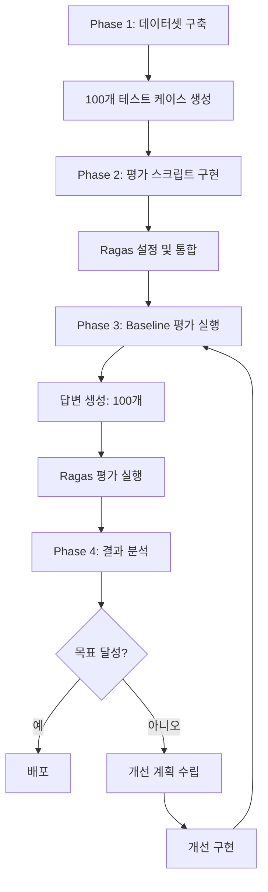

# RAG 평가 시스템 구축 및 테스트 계획서

## 📋 계획 개요

### 목적
FDA 의약품 정보 RAG 시스템의 성능을 객관적으로 평가하기 위한 종합 평가 시스템 구축

### 범위
1. 테스트 데이터셋 설계 및 구축
2. 평가 프레임워크 선정 및 구현
3. 평가 메트릭 정의
4. 평가 실행 및 결과 분석
5. 개선 방향 도출

### 일정
- **Phase 1 (데이터 준비)**: 1-2일
- **Phase 2 (평가 스크립트 구현)**: 1-2일
- **Phase 3 (평가 실행)**: 0.5일
- **Phase 4 (결과 분석)**: 0.5일

---

## Phase 1: 테스트 데이터셋 구축

### 1.1 데이터셋 설계

**목표**: 실제 사용 시나리오를 대표하는 100개의 테스트 케이스 구축

**데이터 구조**:
```json
{
  "question": "타이레놀은 어떤 약인가요?",
  "ground_truth": "타이레놀은 아세트아미노펜 성분의 해열진통제입니다...",
  "category": "brand_name",
  "keyword": "Tylenol"
}
```

**카테고리 분류**:
| 카테고리 | 설명 | 예시 | 목표 개수 |
|----------|------|------|-----------|
| `brand_name` | 브랜드명 기반 질문 | "타이레놀은?" | 20개 |
| `generic_name` | 성분명 기반 질문 | "아세트아미노펜 부작용은?" | 20개 |
| `indication` | 증상/효능 기반 질문 | "두통약 추천" | 10개 |

**품질 기준**:
- ✅ 실제 사용자가 물을 법한 자연스러운 질문
- ✅ 난이도 분포: 쉬움 30%, 보통 50%, 어려움 20%
- ✅ OpenFDA API에서 답변 가능한 질문
- ✅ 명확한 정답(ground_truth) 존재

### 1.2 데이터 수집 전략

**Step 1: 질문 수집**
- [ ] 실제 사용자 로그 분석 (있는 경우)
- [ ] 의약품 관련 FAQ 참고
- [ ] 팀 브레인스토밍

**Step 2: 카테고리 분류**
- [ ] 각 질문의 카테고리 할당
- [ ] 검색 키워드 추출

**Step 3: Ground Truth 작성**
- [ ] OpenFDA 데이터 기반 정답 작성
- [ ] 2-3문장 길이
- [ ] 핵심 정보 포함

**Step 4: 검증**
- [ ] 팀 리뷰
- [ ] 중복 질문 제거
- [ ] 난이도 균형 확인

### 1.3 데이터셋 파일 생성

**출력 파일**: `evaluation/data/test_dataset.json`

**검증 체크리스트**:
- [ ] 총 100개 케이스
- [ ] 모든 필수 필드 포함 (question, ground_truth, category, keyword)
- [ ] JSON 형식 유효성 확인
- [ ] 인코딩 UTF-8

---

## Phase 2: 평가 스크립트 구현

### 2.1 평가 프레임워크 선정

**선택**: Ragas (Retrieval-Augmented Generation Assessment)

**이유**:
- ✅ RAG 시스템 전문 평가 라이브러리
- ✅ 4가지 핵심 메트릭 제공
- ✅ LangChain 호환
- ✅ 오픈소스

**대안 고려**:
- BLEU, ROUGE: 단순 텍스트 유사도만 측정
- Human Evaluation: 시간 소요, 주관적

### 2.2 평가 메트릭 정의

| 메트릭 | 측정 대상 | 의미 | 목표 |
|--------|-----------|------|------|
| **Faithfulness** | 답변 ↔ 컨텍스트 | 답변이 검색 문서에 근거하는가 | 0.8+ |
| **Answer Relevancy** | 답변 ↔ 질문 | 답변이 질문과 관련 있는가 | 0.6+ |
| **Context Precision** | 컨텍스트 품질 | 검색이 정확한가 | 0.8+ |
| **Context Recall** | 검색 완전성 | 필요한 정보를 모두 검색했는가 | 0.7+ |

**전체 목표**: 평균 0.75 이상

### 2.3 스크립트 구조 설계

**필요한 스크립트**:

1. **`evaluate_rag.py`** - 기본 평가 스크립트
   - 답변 생성 + 평가 실행
   - 결과 저장

2. **`evaluate_only.py`** - 평가만 실행
   - 생성된 답변 재사용
   - 평가 속도 향상

3. **`evaluate_single.py`** - 단일 설정 평가
   - 특정 최적화 버전 평가
   - 명령줄 인자 지원

4. **`compare_optimizations.py`** - 일괄 비교
   - 여러 버전 평가
   - 비교 리포트 생성

### 2.4 구현 체크리스트

#### 2.4.1 환경 설정
- [ ] `requirements.txt` 업데이트
  ```
  ragas>=0.1.0
  datasets>=2.14.0
  pandas>=2.0.0
  ```
- [ ] 의존성 설치
- [ ] API 키 설정 확인

#### 2.4.2 기본 평가 스크립트
- [ ] 테스트 데이터셋 로드 함수
- [ ] RAG 답변 생성 함수
- [ ] Ragas 평가 함수
- [ ] 결과 저장 함수
- [ ] 진행 상태 표시 (tqdm, colorama)

#### 2.4.3 데이터 형식 변환
- [ ] RAG 출력 → Ragas 입력 형식
  ```python
  {
    "question": str,
    "answer": str,
    "contexts": List[str],
    "ground_truth": str
  }
  ```

#### 2.4.4 예외 처리
- [ ] API 호출 실패
- [ ] 평가 오류
- [ ] 파일 I/O 에러

---

## Phase 3: 평가 실행

### 3.1 사전 점검

**시스템 점검**:
- [ ] OpenFDA API 접근 가능
- [ ] OpenAI API 키 유효
- [ ] 충분한 API 크레딧
- [ ] 안정적인 네트워크 연결

**데이터 점검**:
- [ ] `test_dataset.json` 존재
- [ ] 100개 케이스 모두 유효
- [ ] RAG 시스템 정상 작동

### 3.2 Baseline 평가 실행

**실행 명령**:
```bash
cd evaluation/scripts
python evaluate_rag.py
```

**예상 소요 시간**:
- 답변 생성: ~20분 (100개 × 12초)
- Ragas 평가: ~10분 (100개 × 6초)
- **총 약 30분**

**모니터링 항목**:
- [ ] 진행률 표시 정상
- [ ] 에러 발생 여부
- [ ] API 호출 성공률

### 3.3 결과 저장

**출력 파일**:
- `evaluation/data/generated_answers.json` - 생성된 답변
- `evaluation/results/evaluation_baseline.json` - 평가 점수

**결과 구조**:
```json
{
  "config": "baseline",
  "metrics": {
    "faithfulness": 0.xxx,
    "answer_relevancy": 0.xxx,
    "context_precision": 0.xxx,
    "context_recall": 0.xxx
  }
}
```

---

## Phase 4: 결과 분석 및 개선 방향 도출

### 4.1 점수 분석

**분석 기준**:
| 점수 범위 | 평가 | 액션 |
|-----------|------|------|
| 0.8 ~ 1.0 | 우수 | 유지 |
| 0.6 ~ 0.8 | 양호 | 개선 고려 |
| 0.4 ~ 0.6 | 보통 | 개선 권장 |
| 0.0 ~ 0.4 | 미흡 | 즉시 개선 필요 |

**분석 템플릿**:
```
1. Faithfulness 분석
   - 점수: X.XXX
   - 평가: [우수/양호/보통/미흡]
   - 원인 분석:
   - 개선 방향:

2. Answer Relevancy 분석
   - ...
```

### 4.2 문제 진단

**낮은 점수의 원인 분류**:

1. **Faithfulness 낮음**
   - 환각(hallucination) 발생
   - 검색 문서 무시
   → 프롬프트 수정 필요

2. **Answer Relevancy 낮음**
   - 질문 의도 파악 미흡
   - 불필요한 정보 과다
   → 프롬프트 간소화 필요

3. **Context Precision 낮음**
   - 불필요한 문서 검색
   - 중복 결과 많음
   → 검색 필터링 필요

4. **Context Recall 낮음**
   - 필요한 정보 누락
   - 검색 범위 부족
   → 검색 확대 필요

### 4.3 개선 전략 수립

**우선순위 결정 기준**:
1. 가장 낮은 점수 메트릭 우선
2. 개선 난이도 고려
3. 비용 효율성 고려

**개선 옵션**:

| 개선 방법 | 효과 메트릭 | 난이도 | 비용 | 우선순위 |
|-----------|-------------|--------|------|----------|
| 프롬프트 최적화 | Answer Relevancy | 낮음 | 무료 | 🔴 1순위 |
| 중복 제거 | Context Precision | 중간 | 무료 | 🟡 2순위 |
| 두 단계 검색 | Context Recall | 중간 | 무료 | 🟡 2순위 |
| GPT-4 업그레이드 | 전반적 | 낮음 | 15배 | 🟢 3순위 |

### 4.4 보고서 작성

**작성 문서**:
1. **EVALUATION_REPORT.md**
   - 평가 조건
   - 평가 방법
   - 평가 결과
   - 개선 방안

2. **TEST_PLAN.md** (다음 단계)
   - Phase별 개선 계획
   - 실행 방법
   - 성공 기준

---

## 📊 전체 테스트 흐름도



---

## 📝 실행 체크리스트

### Phase 1: 데이터셋 구축
- [ ] 100개 질문 수집
- [ ] 카테고리 분류 (브랜드명 40, 성분명 40, 증상 20)
- [ ] Ground truth 작성
- [ ] `test_dataset.json` 생성
- [ ] 팀 리뷰 완료

### Phase 2: 평가 스크립트 구현
- [ ] Ragas 라이브러리 설치
- [ ] `evaluate_rag.py` 작성
- [ ] `evaluate_only.py` 작성
- [ ] 데이터 형식 변환 함수 구현
- [ ] 테스트 실행 (샘플 2-3개)
- [ ] 코드 리뷰

### Phase 3: Baseline 평가 실행
- [ ] API 키 및 환경 확인
- [ ] 전체 평가 실행 (100개)
- [ ] 에러 없이 완료
- [ ] 결과 파일 생성 확인

### Phase 4: 결과 분석
- [ ] 4개 메트릭 점수 확인
- [ ] 평균 점수 계산
- [ ] 문제점 진단
- [ ] 개선 방향 도출
- [ ] 평가 보고서 작성

---

## 🚨 예상 문제 및 대응

### 문제 1: Ragas 설치/실행 오류
**증상**: `ImportError`, `ModuleNotFoundError`
**대응**:
```bash
pip install --upgrade ragas datasets langchain-openai
```

### 문제 2: API 호출 실패
**증상**: OpenFDA API 타임아웃, Rate Limit
**대응**:
- Retry 로직 구현
- API 호출 간 딜레이 추가
- 실패한 케이스만 재실행

### 문제 3: Ragas 평가 오류
**증상**: `EvaluationResult` 형식 오류
**대응**:
- `to_pandas()` 메서드 사용
- DataFrame에서 평균 계산
- 문서 확인 및 업데이트

### 문제 4: 평가 시간 과다
**증상**: 100개 평가에 2시간 이상 소요
**대응**:
- 샘플 10개로 먼저 테스트
- API 병렬 호출 고려
- 캐싱 활용

---

## 📁 산출물

### 필수 파일
1. `evaluation/data/test_dataset.json` - 테스트 데이터셋
2. `evaluation/scripts/evaluate_rag.py` - 평가 스크립트
3. `evaluation/data/generated_answers.json` - 생성된 답변
4. `evaluation/results/evaluation_baseline.json` - 평가 결과

### 문서
1. `evaluation/docs/EVALUATION_REPORT.md` - 평가 보고서
2. `evaluation/docs/README.md` - 평가 시스템 사용법

---

## 🎯 성공 기준

### Phase 1 완료 기준
- ✅ 100개 테스트 케이스 생성
- ✅ 카테고리 균형 유지
- ✅ 팀 리뷰 통과

### Phase 2 완료 기준
- ✅ 평가 스크립트 정상 작동
- ✅ 샘플 데이터 평가 성공
- ✅ 코드 리뷰 통과

### Phase 3 완료 기준
- ✅ 100개 전체 평가 완료
- ✅ 에러 없이 실행
- ✅ 결과 파일 정상 생성

### Phase 4 완료 기준
- ✅ 모든 메트릭 점수 확인
- ✅ 문제 진단 완료
- ✅ 개선 계획 수립
- ✅ 평가 보고서 작성

---

## 📞 지원 및 참고

### 참고 문서
- [Ragas 공식 문서](https://docs.ragas.io/)
- [OpenFDA API 가이드](https://open.fda.gov/apis/)
- [LangChain 문서](https://python.langchain.com/)

### 팀 지원
- 문제 발생 시 슬랙 채널에 공유
- 코드 리뷰 요청
- 정기 진행 상황 공유
